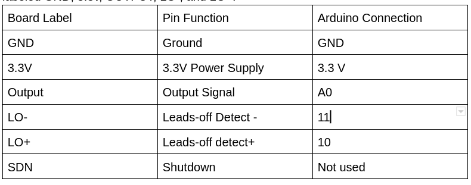
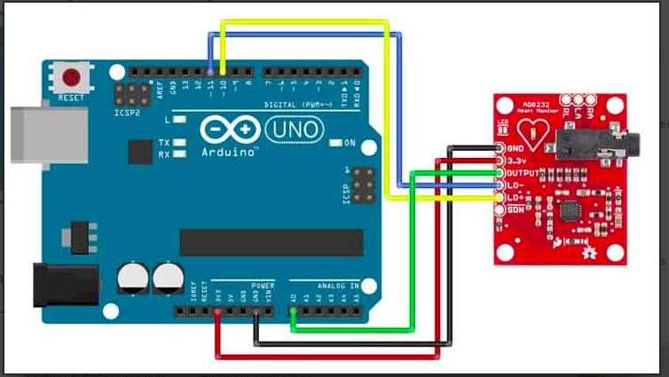
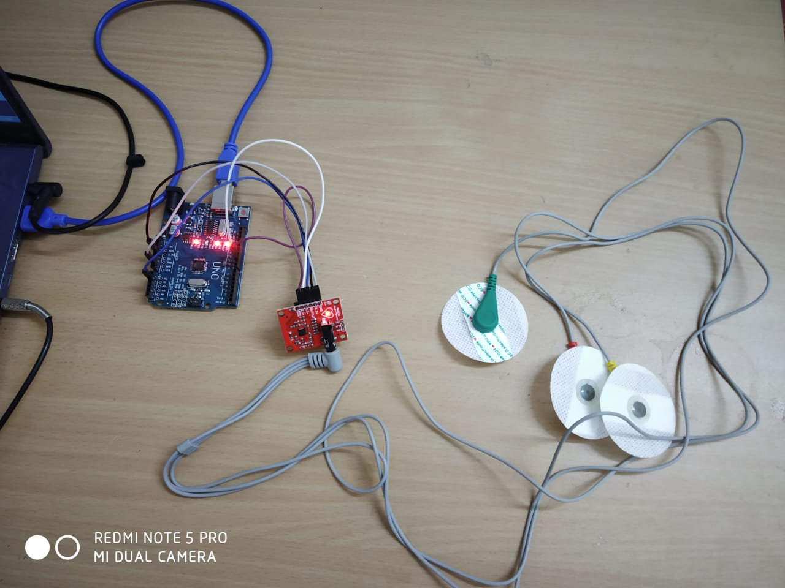

# ECG Monitoring Device Using IOT

## Background
An ECG records the electrical signals in the heart. It is a common method to detect the heart problems and monitor the heart's health.
The ECG is a physiological wave signal that describes the electrical activity of the heart.
The heart diseases have become one of the growing reasons for sudden deaths. Regularing monitoring of the heart's health by the physician can go a long way in improving a patient's health. However it is an expensive process available only in the hospitals. However, with the help of Internet of Things, ECG data can be obtained using the AD8232 chip and the Arduino UNO chip to be further stored and processes in a relatively inexpensive method. 

In this project, we explore the various methods in which the data can be acquired and stored in servers.

## Proposition

One of the methods of the acquisition of the ECG data and storage is using the AD8232 and Arduino UNO to acquire ECG data and storing it in the Ubidots server.

The other methods which are currently being explored are using the AD8232 ECG sensor to read the data, Arduino UNO, ESP8266 Wi-Fi module and the IOT Blynk application. 

## Materials Required: 
1. Single lead AD8232
2. NodeMCU(ESP8266)
3. ECG Electrodes
4. Arduino board(Arduino UNO R3 
Development Board)
5. Three connector
6. Breadboard

## Basic Setup and Connection Diagram

We will connect five of the nine pins on the board to Arduino. The five pins we need are labeled GND, 3.3v, OUTPUT, LO-, and LO+.

The schematic of the proposed arrangement:

### Arrangement 

